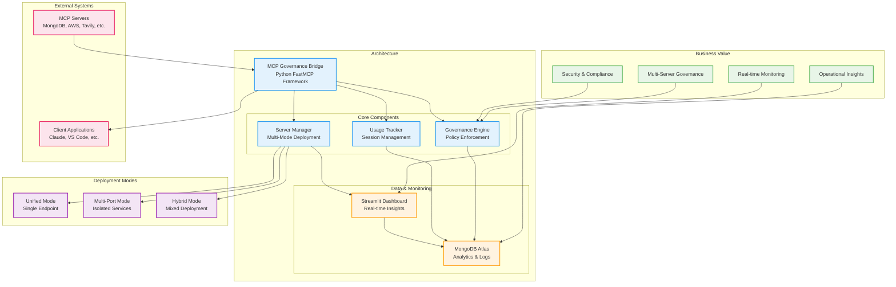

# MCP Governance Bridge



## 🗂️ **Project Structure**

```
mcp-governance-bridge/
├── app/
│   ├── __init__.py
│   ├── governance_server_manager.py
│   └── main.py
├── core/
│   ├── __init__.py
│   ├── usage_tracker.py
│   └── governance_engine.py
├── database/
│   ├── __init__.py
│   └── atlas_client.py
├── dashboard/
│   ├── __init__.py
│   ├── streamlit_dashboard.py
│   └── dashboard_utils.py
├── utils/
│   ├── __init__.py
│   └── config_loader.py
│   └── logger.py
├── requirements.txt
└── pyproject.toml
```

## 🚀 **Usage Instructions**

### **1. Setup**
```bash
# Install dependencies
pip install -r requirements.txt

# Set environment variables
export MONGODB_URI="mongodb+srv://your-atlas-uri"
export MONGODB_DATABASE="mcp_governance"
```

### **2. Run the Application**
```bash
# Use run.sh
./run.sh
#============
# Or
# Start the governance bridge
python app/main.py

# Or use the CLI
mcp-governance
```

### **3. Access Dashboard**
```bash
# Dashboard will be available at:
http://localhost:8501
```

### **4. API Endpoints**
```bash
# Unified mode
http://localhost:8173/mcp/
http://localhost:8173/dashboard
http://localhost:8173/governance/metrics

# Multi-port mode
http://localhost:8174/mcp/  # Individual servers
http://localhost:8175/mcp/
http://localhost:8176/mcp/
```

This implementation provides:

✅ **Multi-Mode Deployment** (Unified, Multi-Port, Hybrid)  
✅ **Streamlit Dashboard** with real-time monitoring  
✅ **MongoDB Atlas Integration** for comprehensive data storage  
✅ **Usage Tracking** with detailed analytics  
✅ **Governance Engine** with policy enforcement  
✅ **Enterprise-Ready** architecture with proper error handling  
✅ **Configurable** through JSON configuration  
✅ **Extensible** design for adding new features  

The system automatically tracks all MCP tool usage, enforces governance policies, and provides comprehensive monitoring through the Streamlit dashboard!

